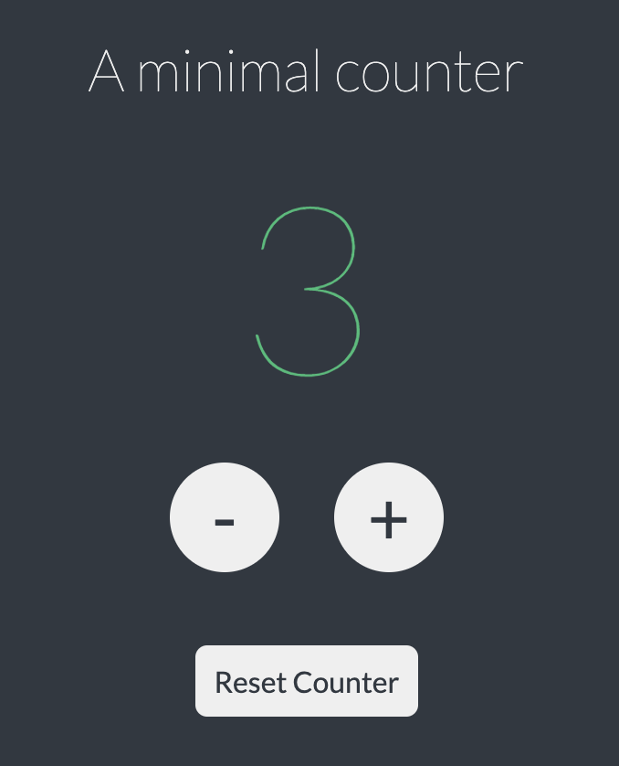

# A minimal counter

<!-- TABLE OF CONTENTS -->
  
Table of Contents

  <ol>
    <li>
      <a href="#general-info">General Info</a>
    </li>
    <li><a href="#download">Screenshots</a></li>
    <li><a href="#contactMe">Contact Me</a></li>
  </ol>
  
## General Info

A project of Javascript for Start2Impact. 
The counter was made with Javascript (buttons were created with js too), styled in css.

## Screenshots

