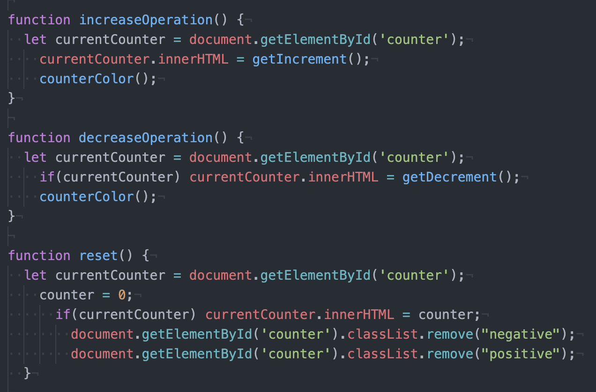

# A minimal counter

<!-- TABLE OF CONTENTS -->
  
Table of Contents

  <ol>
    <li>
      <a href="#general-info">General Info</a>
    </li>
    <li><a href="#screenshots">Screenshots</a></li>
    <li><a href="#contact-me">Contact Me</a></li>
  </ol>
  
## General Info

A project of Javascript for Start2Impact. 
The counter was made with Javascript (buttons were created with js too), styled in css.

## Screenshots

## Contact Me

Let me know what you think about this little project!

Telegram: https://t.me/lorenzocozza  
Instagram: https://www.instagram.com/lorenzocozza  
Facebook: https://www.facebook.com/LorenzoCozza  
