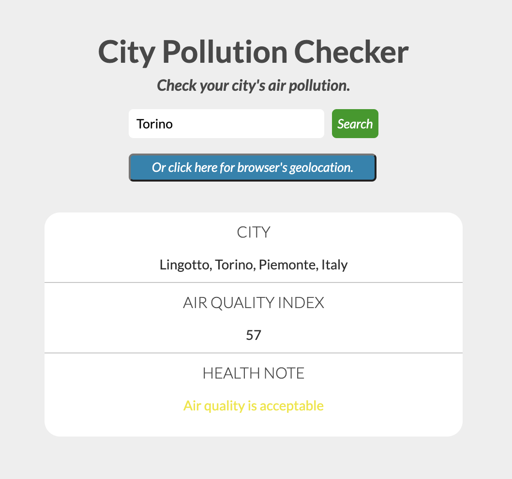
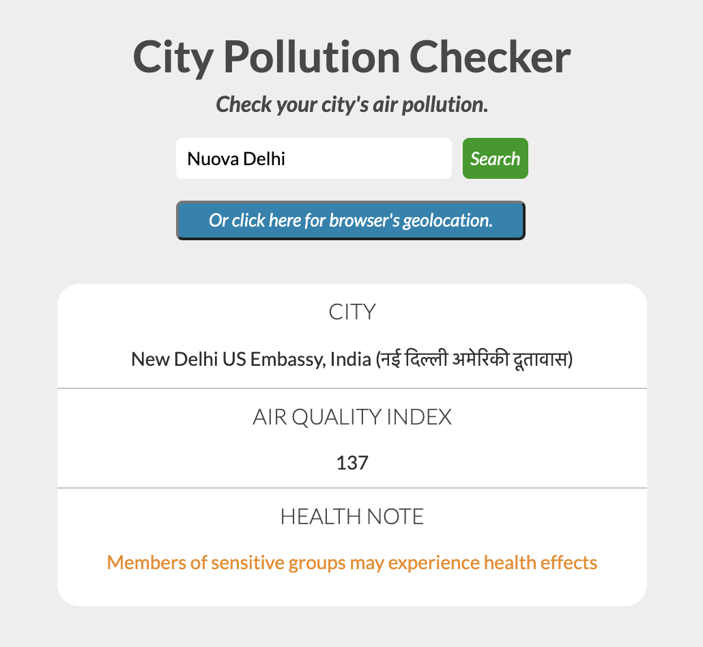
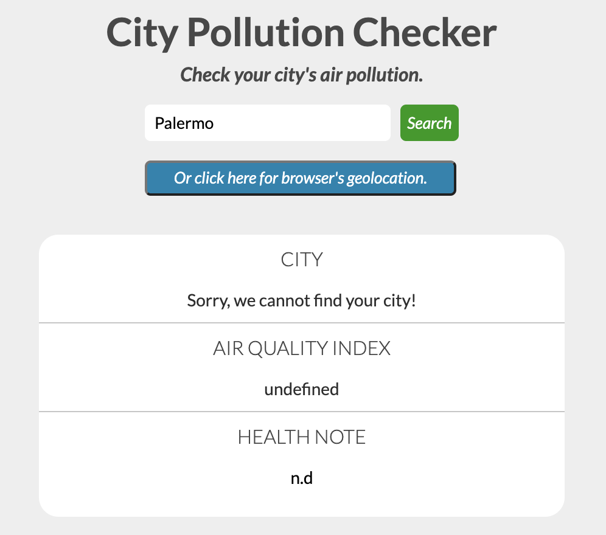
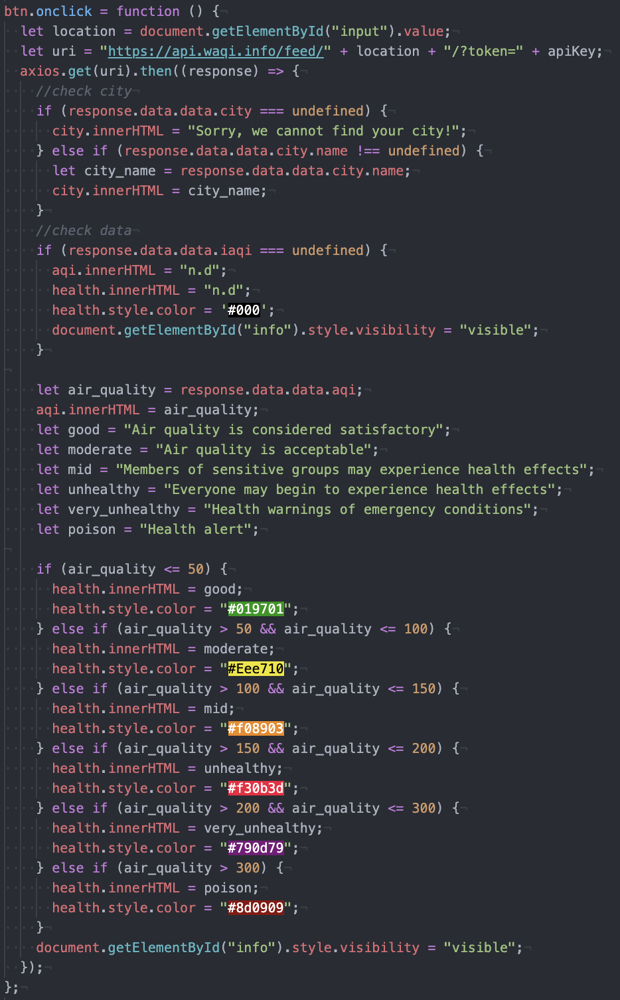

# City Pollution App

<!-- TABLE OF CONTENTS -->
  
Table of Contents

  <ol>
    <li>
      <a href="#general-info">General Info</a>
    </li>
    <li><a href="#screenshots">Screenshots</a></li>
    <li><a href="#try-it">Try It</a></li>
  </ol>
  
## General Info

A Javascript project for Start2Impact. 
The app gives you info, through the use of an API, about the air pollution in a city that you decided to check. 
I used Axios, a js library, to process the user's input and display info that he required.
In case a city isn't available, the app will display an error message.

## Screenshots

## Try It

You can try my app here: https://stoic-davinci-77c00b.netlify.app/
